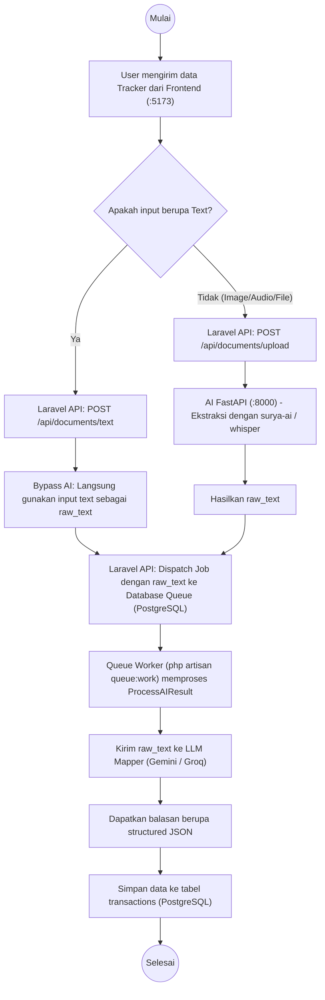

# Activity Diagram - Fitur Tracker

Diagram aktivitas ini menggambarkan alur kontrol dari pengiriman data (media atau teks) hingga diproses menjadi transaksi yang disimpan di *database* sesuai arsitektur terbaru.

