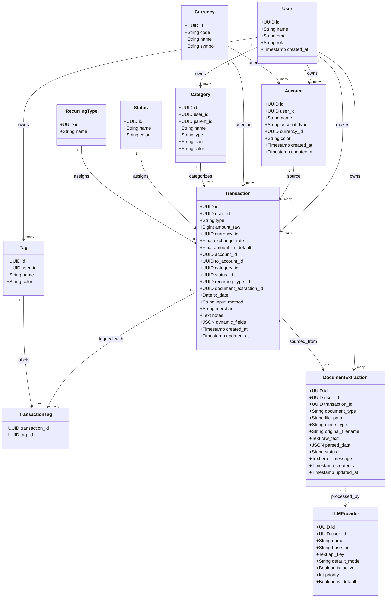

# Class Diagram - Fitur Tracker (Transaction)

Diagram Kelas ini merepresentasikan struktur ideal (Best Practice) pada *backend* Laravel untuk mengelola fitur Tracker (Transaction). Alih-alih sekadar menyalin struktur *database* ERD, diagram ini menunjukkan interaksi antara komponen MVC (Controller, Service Layer, dan Eloquent Models) yang berfokus penuh pada entitas `Transaction`.

