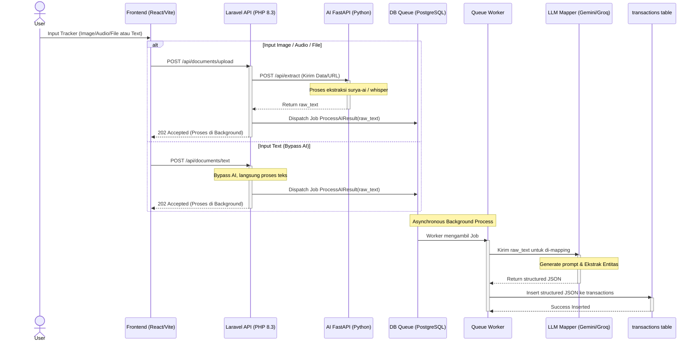

# Sequence Diagram - Fitur Tracker

Diagram urutan ini memodelkan interaksi antar *services* (Frontend, Laravel API, AI FastAPI, Queue, Worker, dan LLM) secara asinkron (background process) untuk menghasilkan data transaksi.

