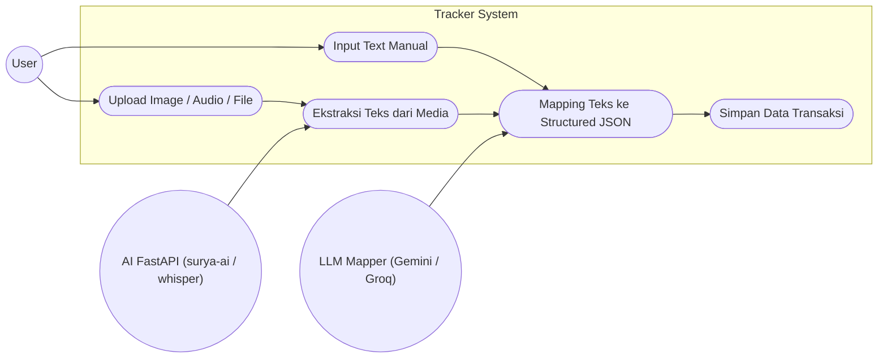

# Use Case Diagram - Fitur Tracker

Diagram Use Case ini menggambarkan interaksi antara pengguna (User) dengan sistem serta aktor sistem lainnya (AI FastAPI dan LLM) dalam memproses media menjadi transaksi terstruktur.

