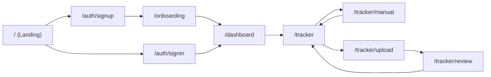

# Navigation Flow - Fitur Tracker

Diagram navigasi ini menggambarkan alur perpindahan antarmuka/halaman bagi pengguna (UI/UX flow) mulai dari tahap autentikasi (Sign In / Sign Up) hingga masuk ke dalam fungsionalitas fitur Tracker beserta hasil prosesnya.

## 📋 Daftar Halaman (Page List)

Berikut adalah urutan halaman (*pages*) yang dilalui pengguna dari tahap awal hingga mencapai fitur Tracker:

1. **`/` (Landing Page)**: Halaman awal perkenalan aplikasi.
2. **`/auth/signup`** atau **`/auth/signin`**: Halaman pendaftaran akun baru atau masuk untuk pengguna lama.
3. **`/onboarding`**: Halaman *setup* profil dan preferensi awal (khusus pengguna baru setelah *Sign Up*).
4. **`/dashboard`**: Halaman beranda utama yang merangkum kondisi finansial pengguna.
5. **`/tracker`**: Halaman utama fitur Tracker (menampilkan daftar riwayat transaksi terbaru).
6. **`/tracker/manual`**: Halaman formulir untuk menginput transaksi secara manual.
7. **`/tracker/upload`**: Halaman interaktif untuk mengunggah media (Image/Audio/File) atau teks (*bypass* AI).
8. **`/tracker/review`**: Halaman validasi (*Review Draft*) untuk memeriksa hasil data yang diekstrak oleh AI sebelum disimpan.

---

## 🗺️ Diagram Flow

